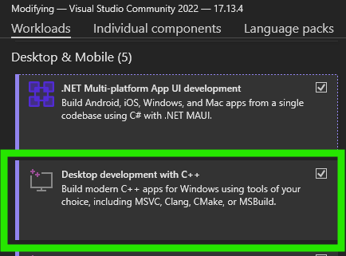
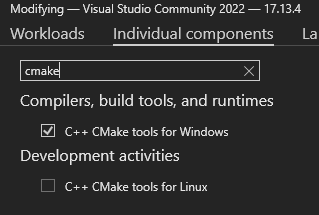

# Unofficial D++ CMake Template for Windows

# **THIS REPOSITORY AND DOCUMENTATION IS UNDER DEVELOPMENT, PLEASE DO NOT USE IT YET!**

This is an unofficial sample repository to get started quickly on writing Discord bots
with C++ on Windows, with Visual Studio Code and CMake (technically, nothing is
stopping you from also using this on Linux, but Linux is omitted for
the sake of brevity).

The D++ library is included as a Git submodule and vcpkg (also a submodule)
is used to manage other dependencies.

There are multiple ways to achieve the same result, but this template is based
on my opinionated way of doing C++ development.

## Quickstart

To get started with Visual Studio Code on Windows with this template,
watch this quickstart video:

#### TODO: PUT THE LINK HERE!

## Prerequisites

### Install Visual Studio 2022

VS 2022 is needed for the build tools even though you do not need to use it for
actual development. Make sure you have at least the "Desktop Development with C++"
and "C++ CMake tools for Windows" workloads and components installed.





### Install Git for Windows

As long as ```git.exe``` is available on your system, everything should be good to go.
If not, you can get Git from the following link:

https://git-scm.com/downloads/win

Download the 64-bit Git for Windows Setup Standalone Installer.

Git for Windows installed with the Visual Studio Installer should also work,
but I do not personally use it so I cannot vouch for it.

## Building

TODO

## Dependency management with vcpkg

TODO

## Updating D++ and vcpkg

#### D++

```sh
```

#### vcpkg

If you need to update the vcpkg submodule you can run the following commands:
```sh
git submodule update --remote submodules/vcpkg
git add submodules/vcpkg
git commit -m "Update vcpkg submodule"
```

Updating vcpkg will update all dependencies installed from
vcpkg to their latest versions on vcpkg, which is good to do
regularly, unless you have a reason to stay at specific version.
