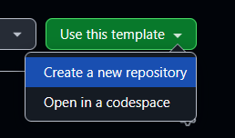
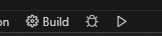

# Unofficial D++ CMake Template for Windows

# **THIS REPOSITORY AND DOCUMENTATION IS UNDER DEVELOPMENT, PLEASE DO NOT USE IT YET!**

This is an unofficial sample repository to get started quickly on writing Discord bots
with C++ on Windows, with Visual Studio Code and CMake (technically, nothing is
stopping you from also using this on Linux, but Linux is omitted for
the sake of brevity).

The D++ library is included as a Git submodule and vcpkg (also a submodule)
is used to manage other dependencies.

CMake configure and build presets are defined in
[CMakePresets.json](./CMakePresets.json). You can use it as an example
to customize the builds.

There are multiple ways to achieve the same result, but this template is based
on my opinionated way of doing C++ development.

## Quickstart

To get started with Visual Studio Code on Windows with this template,
watch this quickstart video:

#### TODO: PUT THE LINK HERE!

## Prerequisites

### Install Visual Studio 2022

VS 2022 is needed for the build tools even though you do not need to use it for
actual development. Make sure you have at least the "Desktop Development with C++"
and "C++ CMake tools for Windows" workloads and components installed.


### Install Git for Windows

As long as ```git.exe``` is available on your system, everything should be good to go.
If not, you can get Git from the following link:

https://git-scm.com/downloads/win

Download the 64-bit Git for Windows Setup Standalone Installer.

Git for Windows installed with the Visual Studio Installer should also work,
but I do not personally use it, so I cannot vouch for it.

## Building

Make a copy of this repository:



---

Clone the repository you just created, **with submodules**:

```sh
git clone THE_CLONE_URL_OF_YOUR_REPO --recurse-submodules
```

---

To make VS build tools available to VS Code, you have to launch VS Code from the
VS Developer Command Prompt or VS Developer Powershell:

https://learn.microsoft.com/en-us/visualstudio/ide/reference/command-prompt-powershell?view=vs-2022#start-from-windows-menu

---

Once you have the prompt open, navigate to your project folder and
open VS Code there:

```
cd path\to\my\bot\project
code .
```

---

You can then select the desired CMake preset using the VS Code CMake
tools GUI, and build and run the code from the GUI,

*OR*

build manually from the VS Code terminal:

First, list the available CMake presets:

```sh
cmake --list-presets          # List configure presets.
cmake --build --list-presets  # List build presets.
```

If you want to then build the Windows x64 Debug config,
run the following commands:

```sh
cmake --preset config-windows-debug-x64
cmake --build --preset windows-debug-x64
```

### VS Code extensions

Recommended extensions from Microsoft:

- C/C++
- C/C++ Extension Pack
- C/C++ Themes
- CMake Tools

## Environment variables

The program reads the bot token from the `DISCORD_BOT_TOKEN` environment
variable by default.

## Running the bot

You can run and debug the bot from the VS Code UI, provided that you
have first set the bot token in your environment variables:



Or you can also create a launch configuration based on the
[example launch configuration](./example_vscode_launch_configuration.json).

https://code.visualstudio.com/docs/debugtest/debugging-configuration

## Dependency management with vcpkg

New dependencies from vcpkg can be added in [vcpkg.json](./vcpkg.json),
in the `dependencies` block.

## Updating D++ and vcpkg

#### D++

A word of warning: since this template is using D++ latest
commit on the main branch, it is not guaranteed to be stable.
If you need guaranteed stability, set the submodule manually
to a specific release tag. Find a Git tutorial on how to do that.

Updating the dpp submodule to the latest commit:

```sh
git submodule update --remote submodules/dpp
git add submodules/dpp
git commit -m "Update dpp submodule"
```

#### vcpkg

If you need to update the vcpkg submodule you can run the following commands:

```sh
git submodule update --remote submodules/vcpkg
git add submodules/vcpkg
git commit -m "Update vcpkg submodule"
```

Updating vcpkg will update all dependencies installed from
vcpkg to their latest versions on vcpkg, which is good to do
regularly, unless you have a reason to stay at specific version.

## GitHub Actions

This template uses GitHub Actions to build the project on
every commit to the master branch. If you do not need the
actions, you can safely delete the [.github](./.github) directory
from your own repository.
